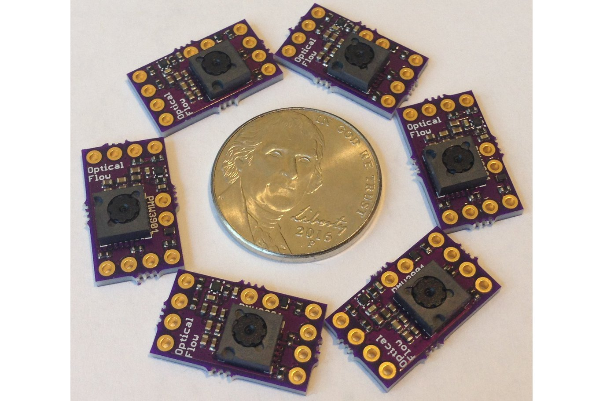

# Arduino driver for PMW3901 optical flow sensor

This library is based on on the C 
[driver code](https://github.com/bitcraze/crazyflie-firmware/blob/9343aa686600aa5f04beb43549c81bdfda1f9cb8/src/drivers/src/pmw3901.c#L218)
for the [Crazyflie](https://www.bitcraze.io/products/crazyflie-2-1/)
 quadcopter from  Bitcraze.  Unlike the Bitcraze PMW3901 [ Arduino repository](https://github.com/bitcraze/Bitcraze_PMW3901), 
their C driver provides a data structure that includes a flag for whether motion
was detected, which may be useful to know for sensor fusion.  Hence my C++
class returns this flag along with the delta-X and delta-Y motion values.  The class offers the
following features:

1. Uses header-only C++ for main class

2. Supports cross-platform development defining an 
[API](https://github.com/simondlevy/PMW3901/blob/master/src/spi_compat.h)
of required methods for SPI communication

3. Supports different SPI buses (e.g., Arduino SPI1)

